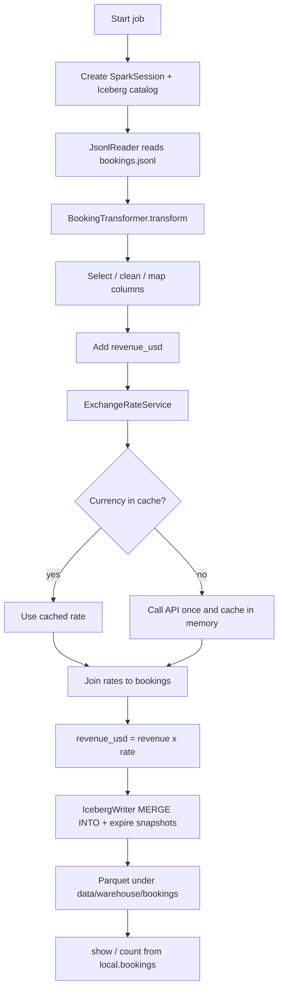

# Booking ETL (PySpark + Iceberg)

Local PySpark job that reads booking JSONL, transforms fields, converts revenue to USD, and writes an **Iceberg** table (Parquet data files) under `data/warehouse/`.

## Docs

| File | Purpose |
|------|---------|
| [README.md](README.md) | Overview, structure, how to run, pipeline diagram |
| [AGENTS.md](AGENTS.md) | **Rules for AI agents** — what to maintain and how |

## Job vs pipeline?

| Name | When to use |
|------|-------------|
| **`src/main.py`** | User entrypoint (`python -m src.main ...`) |
| **`src/jobs/`** | Job logic dispatched by `--cron-name` |
| **`pipelines/`** | Orchestration (Airflow DAGs) that call main — optional later |

## Project structure

```text
config/
  settings.py                 # paths, Spark memory, Iceberg catalog/table
src/
  main.py                     # entrypoint — CLI (--cron-name, dates) + dispatch
  jobs/
    booking_etl.py            # booking job logic
  core/
    spark_session.py          # SparkSessionFactory + Iceberg catalog
  readers/
    jsonl_reader.py           # JsonlReader
    mapping_reader.py         # MappingReader
  services/
    exchange_rates.py         # ExchangeRateService
  transforms/
    bookings.py               # BookingTransformer
  writers/
    iceberg_writer.py         # IcebergWriter
  mappings/                   # lookup JSON objects
data/
  raw/bookings.jsonl          # input
  warehouse/                  # Iceberg warehouse (Parquet + metadata)
spark-submit.sh
requirements.txt
AGENTS.md
```

## How to run

```bash
cd /path/to/pyspark-iceberg-project
source .venv/bin/activate
export JAVA_HOME=$(/usr/libexec/java_home -v 17)
export PYTHONPATH=.

python -m src.main \
  --cron-name booking \
  --updated_from 2026-07-12 \
  --updated_to 2026-07-13
```

```bash
python -m src.main \
  --cron-name migrate_postgres
```

Or (industry style — Iceberg JAR via `spark-submit --packages`):

```bash
./spark-submit.sh \
  --cron-name booking \
  --updated_from 2026-07-12 \
  --updated_to 2026-07-13
```

```bash
./spark-submit.sh \
  --cron-name migrate_postgres
```

| Argument | Required | Example |
|----------|----------|---------|
| `--cron-name` | yes | `booking` or `migrate_postgres` |
| `--updated_from` | yes for booking | `2026-07-12` |
| `--updated_to` | yes for booking | `2026-07-13` |

`src/main.py` starts everything and dispatches by `--cron-name`. Job logic lives in `src/jobs/`.

**Iceberg JAR at runtime**
- `./spark-submit.sh` → only `--packages` + memory (runtime needs); catalog/AQE/etc. stay in `SparkSessionFactory`
- `python -m src.main` → same JAR via `PYSPARK_SUBMIT_ARGS --packages` in `main.py`

First run may download the Iceberg Spark package from Maven (needs network).

> **Note:** `pyspark==4.1.3` is pinned so it matches `iceberg-spark-runtime-4.1_2.13`. PySpark 4.2 is not compatible with current Iceberg runtimes yet.

## Iceberg table

| Setting | Value |
|---------|--------|
| Catalog | `local` (Hadoop catalog) |
| Warehouse path | `data/warehouse/bookings/` (no `default` namespace) |
| Table | `local.bookings` |
| Write | **MERGE INTO** on `transaction_id` |
| Data format | **Parquet** |
| Maintenance | `rewrite_data_files` + `expire_snapshots` (retain last 5) |

`data/` is gitignored (raw + warehouse stay local).

Read back:

```python
spark.table("local.bookings").show()
```

---

## Pipeline at a glance



---

## DAG vs no DAG

Same job either way: `python -m src.jobs.booking_etl`.

| | Without DAG | With DAG |
|--|-------------|----------|
| How | Run the job yourself | Scheduler runs the same job module |
| Logic | Unchanged | Unchanged |

---

## Maintaining this project

Follow **[AGENTS.md](AGENTS.md)**.
