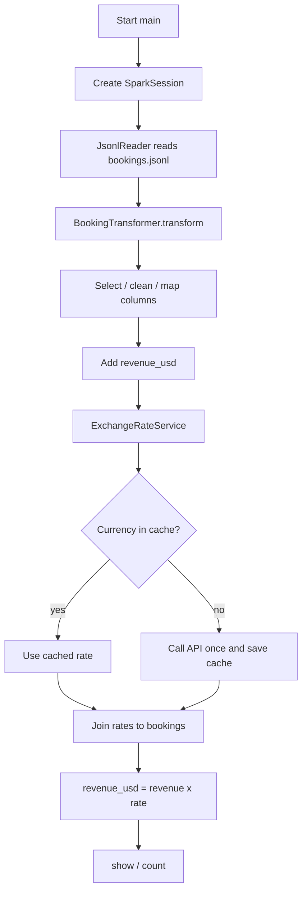

# Booking ETL (PySpark)

Local PySpark job that reads booking JSONL, cleans and maps fields, converts revenue to USD, and prints results.

## Docs

| File | Purpose |
|------|---------|
| [README.md](README.md) | Overview, structure, how to run, pipeline diagram |
| [AGENTS.md](AGENTS.md) | **Rules for AI agents** — what to maintain and how |

## Project structure

```text
config/
  settings.py              # paths, app name, Spark memory settings
src/
  main.py                  # entry point — wires classes and runs the job
  core/
    spark_session.py       # SparkSessionFactory
  readers/
    jsonl_reader.py        # JsonlReader — read bookings
    mapping_reader.py      # MappingReader — object JSON → lookup DataFrame
  services/
    exchange_rates.py      # ExchangeRateService — FX API + in-memory cache
  transforms/
    bookings.py            # BookingTransformer — column transforms + revenue_usd
  mappings/                # small lookup JSON (status, device, region)
data/raw/bookings.jsonl    # input
spark-submit.sh            # convenience runner
requirements.txt
AGENTS.md                  # maintenance rules for AI agents
```

## How to run

```bash
cd /path/to/pyspark-iceberg-project
python3 -m venv .venv
source .venv/bin/activate
pip install -r requirements.txt

export JAVA_HOME=$(/usr/libexec/java_home -v 17)   # Java 17+
export PYTHONPATH=.

python -m src.main
# or
./spark-submit.sh
```

Spark is configured for **4g** driver/executor memory in `config/settings.py` and `PYSPARK_SUBMIT_ARGS` in `src/main.py`.

---

## Pipeline at a glance



---

## DAG vs no DAG (for comparison)

The **same** job code runs either way. Only orchestration changes.

| | Without DAG | With DAG (e.g. Airflow) |
|--|-------------|-------------------------|
| How | `python -m src.main` by hand | Scheduler runs the same command |
| Business logic | In this repo | Unchanged |
| FX API | Inside `ExchangeRateService` | Same, unless you split a “fetch rates” task |
| Schedule / retries | Manual | Handled by the DAG |

**Option A (current):** API inside the Spark job.  
**Option B:** DAG task 1 fetches rates; task 2 runs Spark and only joins. Same `revenue_usd` math; different place for the HTTP call.

---

## Maintaining this project

Follow **[AGENTS.md](AGENTS.md)**.
